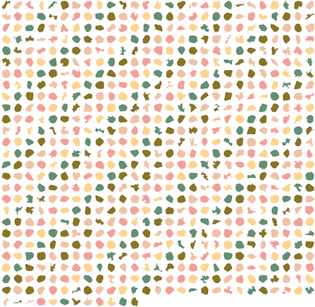

# *Building(s and) Cities*



Repository for the paper "Building(s and) cities: Delineating urban areas with a machine learning algorithm", forthcoming in the *Journal of Urban Economics*.

Authors:

- [Dani Arribas-Bel](https://darribas.org) [`[@darribas]`](https://twitter.com/darribas)
- [Miquel-Angel Garcia-Lopez](http://gent.uab.cat/miquelangelgarcialopez/ca/content/home) [`[@MiquelAngelGL]`](https://twitter.com/MiquelAngelGL)
- [Elisabet Viladecans-Marsal](https://elisabetviladecans.wordpress.com/) [`[@eviladecans]`](https://twitter.com/eviladecans)

## Citation

If you use the code and/or data in this repository, we would appreciate if you
could cite the original paper as:

```
@article{ab_gl_vm2019joue,
  title={Building(s and) cities: 
         Delineating urban areas with a machine learning algorithm},
  author={Arribas-Bel, Daniel and 
          Garcia-L\`{o}pez, Miquel-\'{A}ngel and
          Viladecans-Marsal, Elisabet},
  journal={Journal of Urban Economics},
  year={\emph{forthcoming}},
}
```

## Computational Platform

The analysis in this repository was performed on machines running the `gds_env` platform,
v3.0. The project's website is available at:

> [https://github.com/darribas/gds_env](https://github.com/darribas/gds_env)

And you can install the version used for this projec by first installing
[Docker](https://www.docker.com/) (the community edition, CE, works fine) and
then running:

```
docker pull darribas/gds:3.0
```

You can read more background about platforms like `gds_env` in [Chapter 1](https://geographicdata.science/book/notebooks/01_geospatial_computational_environment.html) of the upcoming book in Geographic Data Science.

